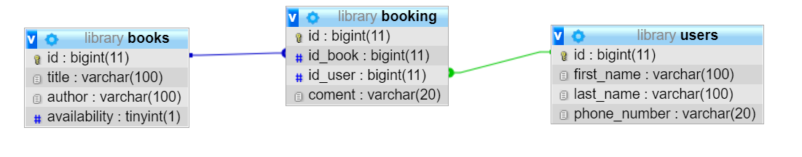
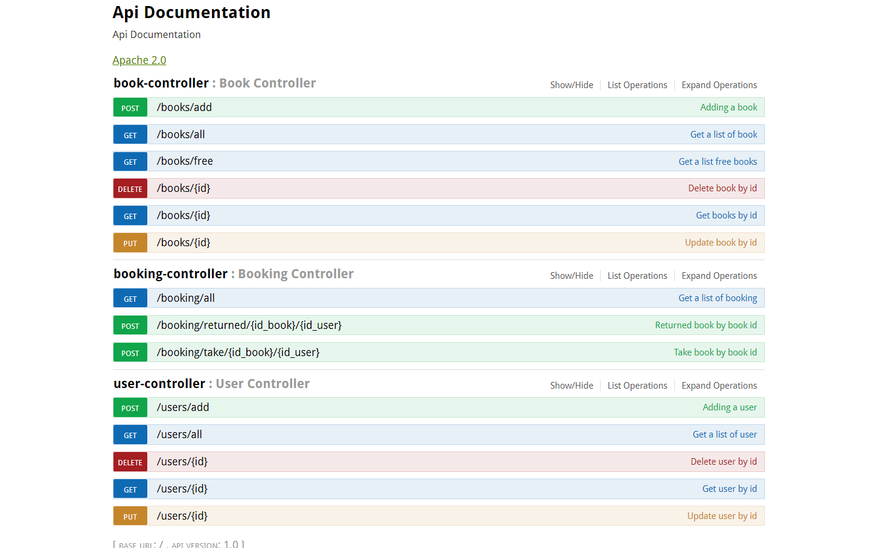

<h1>Technologies</h1>
<ul>
<li>Java 16</li>
<li>Spring Boot</li>
<li>Maven</li>
<li>MySQL 8.0.13</li>
<li>Junit</li>
<li>Mockito</li>
</ul>
<h1>Looking for something in particular?</h1>
<table>
 <thead>
  <tr>
	<th>Layer</th>
	<th>Source</th>
  </tr>
 </thead>
<tbody>
	<tr>
	  <td>REST API controllers</td>
	  <td><a href="https://github.com/DenisDonchenko/rest_api_library/tree/main/src/main/java/com/library/org/library_system/controller">Controllers folder</a></td>	
	</tr>
	<tr>
	  <td>Service</td>
	  <td>Service folder</td>	
	</tr>
	<tr>
	  <td>Repository</td>
	  <td>Repository folder</td>	
	</tr>
	<tr>
	  <td>Tests controllers</td>
	  <td>Tests controllers folder</td>	
	</tr>
	<tr>
	  <td>Tests service</td>
	  <td>Tests service folder</td>	
	</tr>
	<tr>
	  <td>Entities</td>
	  <td>Entities folder</td>	
	</tr>
</tbody>
</table>

<h1>Requirements</h1>
<ul>
<li>JDK 16</li>
<li>Any IDE of your choice . For IntelliJ IDEA: Build, Execution, Deployment -> compiler -> Annotation processors -> Enable annotation processing</li>
<li>MySQL 8.0.13 or latest</li>
</ul>
<h1>Explore Rest APIs</h1>
The app defines following CRUD APIs.
<h3>Books</h3>

<table>
 <thead>
  <tr>
	<th>Method</th>
	<th>Url</th>
	<th>Decription</th>
	<th>Sample Valid Request Body</th>
  </tr>
 </thead>
<tbody>
	<tr>
	  <td>GET</td>
	  <td>/books/all</td>
	  <td>Get a list of book</td>
	  <td>JSON</td>
	</tr>
	<tr>
    <tr>
	  <td>GET</td>
	  <td>/books/free</td>
	  <td>Get a list free books</td>
	  <td>JSON</td>
	</tr>
	<tr>
	  <td>GET</td>
	  <td>/books/{id}</td>
	  <td>Get books by id</td>
	  <td>JSON</td>
	</tr>
	<tr>
	  <td>POST</td>
	  <td>/books/add</td>
	  <td>Adding a book</td>
	  <td>JSON</td>
	</tr>
    <tr>
	  <td>PUT</td>
	  <td>/books/{id}</td>
	  <td>Update book by id</td>
	  <td>JSON</td>
	</tr>	
    <tr>
	  <td>DELETE</td>
	  <td>/books/{id}</td>
	  <td>Delete book by id</td>
	  <td>JSON</td>
	</tr>

</tbody>
</table>
<h3>Users</h3>

<table>
 <thead>
  <tr>
	<th>Method</th>
	<th>Url</th>
	<th>Decription</th>
	<th>Sample Valid Request Body</th>
  </tr>
 </thead>
<tbody>
	<tr>
	  <td>GET</td>
	  <td>/users/all</td>
	  <td>Get a list of user</td>
	  <td>JSON</td>
	</tr>
	<tr>
	  <td>GET</td>
	  <td>/users/{id}</td>
	  <td>Get user by id</td>
	  <td>JSON</td>
	</tr>
	<tr>
	  <td>POST</td>
	  <td>/users/add/</td>
	  <td>Adding a user</td>
	  <td>JSON</td>
	</tr>
	<tr>
	  <td>PUT</td>
	  <td>/users/{id}</td>
	  <td>Update user by id</td>
	  <td>JSON</td>
	</tr>
    <tr>
	  <td>DELETE</td>
	  <td>/users/{id}</td>
	  <td>Delete user by id</td>
	  <td>JSON</td>
	</tr>
</tbody>
</table>

<h3>Booking</h3>

<table>
 <thead>
  <tr>
	<th>Method</th>
	<th>Url</th>
	<th>Decription</th>
	<th>Sample Valid Request Body</th>
  </tr>
 </thead>
<tbody>
	<tr>
	  <td>POST</td>
	  <td>/booking/take/{id_book}/{id_user}</td>
	  <td>Take book</td>
	  <td>JSON</td>
	</tr>
    <tr>
	  <td>POST</td>
	  <td>/booking/returned/{id_book}</td>
	  <td>Returned book</td>
	  <td>JSON</td>
	</tr>
</tbody>
</table>

<h1>Relation</h1>

<h1>Swagger</h1>
<h4>You can use the Swagger API Documentation at http://{Your_Server}:{Port}/swagger-ui.html</h4>

